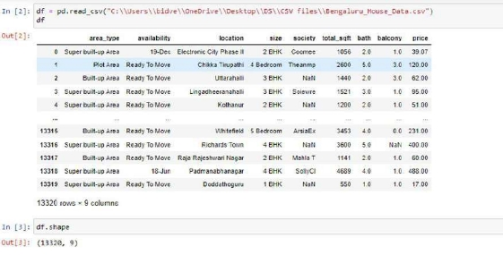
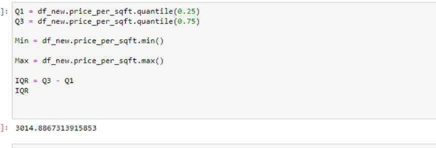
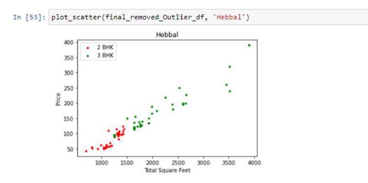
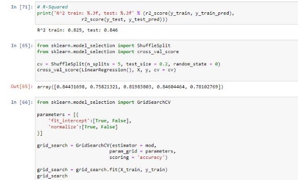
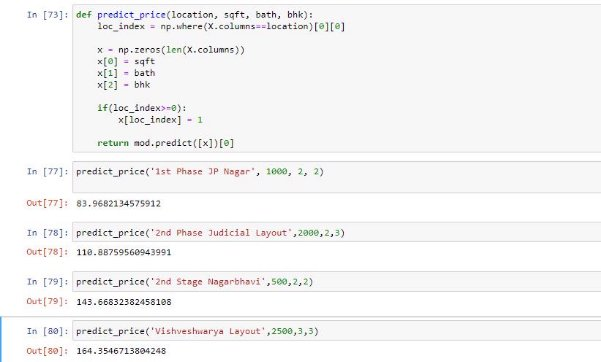
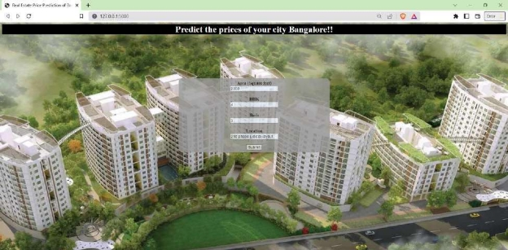

**Real Estate House Price Prediction using Machine Learning techniques** 

School of Computer Science and Engineering, Vellore Institute of Technology CSE3047: Predictive Analytics 

J component- Review 3 Report  

Under guidance of Prof. Nalini N. 

**Contributed by:** 

Srishti Sinha - 20BDS0329 

Bidve Pranav Milind - 20BCE0268 Syed Qasim Kaif - 20BDS0343 Aryan Rajesh - 20BCE0268 

**Abstract** 

House price prediction is a popular topic, and research teams are increasingly performing related studies by using deep learning or machine learning models. House Price Index (HPI) is commonly used to estimate the changes in the house price, since house price is strongly correlated to other factors such as location, area, population it requires other information apart from HPI to predict individual house prices.  Predictive models for deciding sales prices of houses is still a challenging and tricky task in the metropolitan cities. This paper focuses on the modeling and forecasting of land price in the Bengaluru metropolitical Area  (BMA) in the state of Karnataka , India using linear regression and multiple Regression techniques. The data set considers 1298 different and unique localities in and around Bengaluru and predicts the price per square feet of the apartment by taking into consideration various factors like area type, availability, location, society, area of apartment etc. 

**Keywords:** 

*House  Price  Prediction,  Machine  Learning  Model,  House  Price  Index  ,  Deep  Learning, Performance Evaluation, Validation* 

**Introduction** 

House is one of human life's most essential needs, along with other fundamental needs such as food, water, and much more. Demand for houses grew rapidly over the years as people's living standards improved. While there are people who make their house as an investment and property, yet most people around the world are buying a house as their shelter or as their livelihood. 

Housing markets have a positive impact on a country's currency, which is an important national economy scale. Home owners will purchase goods such as furniture and household equipment for their home, and home builders or contractors will purchase raw material to build houses to satisfy house demand, which is an indication of the economic wave effect created by the new house supply. Besides that, consumers have capital to make a large investment, and the construction industry is in good condition as can be seen through a country's high level of house supply. 

Numerous  international  organizations  and  human  rights  have  emphasized  house  importance. Houses are profoundly rooted in the economic, financial, and political structure of each country. Nevertheless,  the fluctuation of house prices has always been an issue for house owners, buildings and real estate, besides that houses have become unaffordable as there is substantial price growth in several countries in the housing sector. Residents' quality of life as well as the national economy depends on the potential house price increase. Ultimately, this issue will affect investors who are making their house as an investment. 

Accurately estimating the value of real estate is an important problem for many stakeholders including house owners, house buyers, agents, creditors, and investors. It is also a difficult one. Though it is common knowledge that factors such as the size, number of rooms and location affect the price, there are many other things at play. Additionally, prices are sensitive to changes in market demand and the peculiarities of each situation, such as when a property needs to be urgently sold. The sales price of a property can be predicted in various ways, but is often based on regression techniques. All regression techniques essentially involve one or more predictor variables as input and a single target variable as output. 

An increase in house demand occurs each year, indirectly causing house price increases every year. The problem arises when there are numerous variables such as location and property demand that may influence the house price, thus most stakeholders including buyers and developers, house builders and the real estate industry would like to know the exact attributes or the accurate factors influencing the house price to help investors make decisions and help house builders set the house price 

Data is the most important part for analysis of any problem. It provides the information in a detailed format which is able to be understood by machines. Real estate prices keep changing frequently based on certain parameters. For a Real estate Business, data is the most important source for analysis and predictions. It is always a perk to know about the predictions of variations of an entity which will be happening in the near future and business managers can act accordingly to avoid future loss. And for this we need a most accurate predicting Model for analysis. Similarly, we need a proper prediction on the real estate and the houses in the housing market to provide appropriate estimation of prices to help real estate managers know about prophecies. Buying a house will be a life time goal for most of the individuals but there are a lot of people who make huge mistakes while buying the properties. One of the common mistakes is buying properties that are too expensive but it's not worth it.  

House price prediction can be done by using multiple prediction models (Machine Learning Model) such as support vector regression, artificial neural network, and more. There are many benefits that home buyers, property investors, and house builders can reap from the house-price model. This model will provide a lot of information and knowledge to home buyers, property investors and house builders, such as the valuation of house prices in the present market, which will help them determine house prices. Meanwhile, this model can help potential buyers decide the characteristics of a house they want according to their budget. 

In general, real estate may have the valuation of land it may be obliged to furnish. A quantitative measure of the profit is carried out by many different Players in the commercial center, for example, land agents, Appraisers, assessors, mortarboard lenders, brokers, Developers, gurus Also reserve managers, lenders,etc. Business worth will be evaluated through that requisition. From claiming valuation systems Also methods that reflect those nature Of property and the condition under which those provided for. The property might well be on the way to the open market under many conditions and circumstances, people are unaware of the current situation and they start losing their money, the change in prices of properties would affect both the common people and the government, to avoid certain circumstances there is a need for price prediction. 

In recent years, Karnataka, one of the hotspots for real estate development, has seen an increase in demand from potential home buyers and investors, and is expected to witness a further boom in the sector by 2020. 

What are the things that a potential home buyer considers before purchasing a house? The location, the size of the property, vicinity to offices, schools, parks, restaurants, hospitals or the stereotypical white picket fence? What about the most important factor — the price? Now with the lingering impact of COVID-19, the enforcement of the Real Estate (Regulation and Development) Act (RERA), and the lack of trust in property developers in the city, housing units sold across India in 2019 dropped by 3 per cent. In fact, the property prices in Bengaluru fell by almost 5 per cent in the second half of 2019, said a study published by property consultancy Knight Frank. 

The objective part in the cost of the land property is included in this suggested model, as are the independent components: no. of rooms, no. of washrooms, cover locale, created area, the floor, age of the property, postal region, degree, and longitude of the property. Other than those of the referred to features, which stay generally expected at house costs, We've incorporated two different components:  air  quality  and  noise  pollution.  These  features  give  a  significant  responsibility towards predicting property costs since the higher potential gains of these components will incite a reduction in house costs. 

Buying a home, especially in a city like Bengaluru, is a tricky choice. While the major factors are usually the same for all metros, there are others to be considered for the Silicon Valley of India. With its help millennial crowd, vibrant culture, great climate and a slew of job opportunities, it is difficult to ascertain the price of a house in Bengaluru 

Our report  covers the measures that have been taken by the use of technology that is accessible and utilizes them to create an unbiased system for predicting house prices. We aimed at utilizing  the previously gathered data from trusted resources and trained and designed a Machine 

Modeling uses machine learning algorithms, where machines learn from the data and use them to predict new data. The most frequently used model for predictive analysis is Bayesian classifier. As we know, the proposed model for accurately predicting future outcomes has applications in economics, business, banking sector, healthcare industry, e-commerce, entertainment, sports etc. One such method used to predict house prices is based on multiple factors. In metropolitan cities like Bengaluru, the potential home buyer considers several factors like location, size , proximity to parks, schools, hospitals, power generation facilities, and most importantly the house price. Bayesian Classifier is one of the statistical techniques for assessing the relationship between the (dependent) target variable and several independent variables. Bayesian classifier techniques are widely used to build a model based on several factors to predict price. In this work, we have made an attempt to build a house price prediction classifier model for a data set that remains accessible to the public in the Machine platform. Machine Learning Machine learning is a process of studying a system based on data. Machine learning is a part of data science where we use machine learning algorithms to process data. Supervised Learning Technique It’s a predictive model used for the tasks where it involves prediction of one value using other values in the data-set. Supervised learning will have predefined labels. It classifies an object based on the parameters to one of the predefined set of labels. We have many algorithms to build models in supervised learning such as KNN,  Naive  Bayes,  Decision  Tree,  ID3,  Random  Forest,  SVM,  Regression  techniques  etc. Depending on the need, labels, parameters and data-set we select the appropriate algorithm for predictions. Algorithms are employed to create a model that makes predictions based on evidence within the presence of uncertainty.  

Learning model in such a way that it provides the best possible predictions of house prices as an output to the user. Thus, this method in which the complete prediction is based upon the previously gathered data, the integrity and truthfulness of the system to the user is maintained. 

The report  is divided into the following sections: Section 2 addresses previous related work, Section 3 explains the description of the data set used, pre-processing of data and exploratory analysis of data before a regression model is built. Section 4 presents a summary of the regression models developed in the comparison study and the evaluation metrics is used. Section 5 sums up the models and concludes with the future scope of the proposed work.  

**Literature Review** 

|**Sr No** |`   `**Journal** |`  `**Author    (Year)** |`   `**Title** |`  `**Relevant Findings**  |`        `**Limitations** |
| - | - | - | - | - | - |
|1\. |IEEE XPLORE |
Pei-Yin G Wang, Chiao -Ting Chen , Jain-WuN Su , Ting-Yun Wang , And Szu-Hao Huang 

(2019) 
|Deep Learning Model for House Price Prediction Using Heterogeneo us Data Analysis Along With Joint Self- Attention Mechanism |
They  employ an attention mechanism and import heterogeneous data into the  developed attention model. In addition to achieving accurate house price prediction, they also  identify the features contributing to house prices. Therefore, they  develop an attention- based model that can learn the interaction between features and summarize crucial attributes for house buyers. 

Helps in making accurate Real Estate based house predictions and in addition to this the 
|
The transaction data do not contain precise house addresses, 

a. Moreover, They  could not retrieve images of house interiors to consider the interior design of the houses. Which are influential elements in price prediction 
|

|||||model also reveals factors influencing house prices. ||
| :- | :- | :- | :- | - | :- |
|2\.  |Science direct  |
Md. Mobin Akhtar, Abu Sarwar Zamani, Shakir Khan, Abdallah Saleh Ali Shatat, Sara Dilshad, Faizan Samdani 

(2022) 
|Stock market prediction based on statistical data using machine learning algorithms |
The main motive of this composition is to discover the stylish version to prognosticate the cost of the inventory request 

For achieving the results The authors have predicted the stock values by the usage of Random Forest and Support Vector Machines  
|
The former outcomes indicate that the stock price is changeable when the use of the traditional classifier  

The actuality of the device stated in large part prophetic values, opting a relevant term for their enjoyment with a purpose to benefit in large part prophetic rankings. 
|

|||||
The Authors could obtain a decent accuracy rate of 78.8% and 80.1% with SVM and Random Forest Classifier  

They are much  more accurate than formerly charged ML models 
||
| :- | :- | :- | :- | :- | :- |
|3\.  |IEEE |
N. Rizun and 

A. Baj- Rogowska 

(2021) 
|Can Web Search Queries Predict Prices Change on the Real Estate Market? |
The main practical contribution of the  research is to determine that Google user search volume can be considered as a sole determinant to anticipate the housing price shift direction with time- lag sufficient for making decisions regarding the purchase (sale) of individual property or the real estate market control. 

An approach 

to the multi -
|The obtained theoretical conclusions regarding the time lag size in the Google user search volume and the price activity dependencies is valid for specific selected countries the methodological conclusion about the significant predictive power of SVI was made based on testing the selected machine-learning classification |

||||||class |models and with |
| :- | :- | :- | :- | :- | - | - |
||||||classification |the small dataset  |
||||||of the HPI ||
||||||values, which ||
||||||allows ||
||||||predicting not ||
||||||only the ||
||||||direction ||
||||||(increasing or ||
||||||decreasing) of ||
||||||the price ||
||||||change but ||
||||||also its ||
||||||relative ||
||||||stability ||
||||||within +/−2% ||
||||||around 100 HPI ||
||||||value. ||
|4\. |IEEE |[The Phan ](https://ieeexplore.ieee.org/author/37088025993)|[Danh ](https://ieeexplore.ieee.org/author/37088025993)|Housing Price Prediction Using Machine Learning Algorithms: The Case of Melbourne City, Australia |This paper seeks useful models for house price prediction. It also provides insights into the Melbourne Housing Market. Firstly, the original data is prepared and |There is a high discrepancy between house prices in the most expensive and most affordable suburbs in the city of Melbourne. Moreover, |
||||||transformed into a |Support Vector |
||||||cleaned dataset |Machine is based |
||||||ready for analysis. |on mean squared |
||||||Data reduction and |error measurement |
||||||transformation are |which is a |
||||||then applied by |competitive |
||||||using Stepwise and |approach.  |
||||||PCA techniques. ||
||||||Different methods ||

|||||are then implemented and evaluated to achieve an optimal solution. The evaluation phase indicates that the combination of Step-wise and SVM model is a competitive approach. Therefore, it could be used for further deployment. This research can also be applied for transactional datasets of the housing market from different locations across Australia.  ||
| :- | :- | :- | :- | :- | :- |
|5\. |IEEE |
Varma, A., Sarma, A., Doshi, S., & Nair, R.  

(2018)  
|House  Price Prediction Using Machine Learning And Neural Networks |A system that aims to provide an accurate prediction of housing prices has been developed. The system makes optimal use of Linear Regression, Forest regression, Boosted regression. The efficiency of the algorithm has been further increased with use of Neural networks. The system will satisfy customers by providing accurate output and |The accuracy of the system can be improved. Several more cites can be included in the system if the size and computational power increases. Furthermore, we can integrate different UI/UX methodology for better visualization of the results in a more interacting way using Augmented Reality. Also, a |

|||||preventing the risk of investing in the wrong house.  |learning system can be created which will gather users feedback and history so that the system can display the most suitable results to the user according to his preferences. |
| :- | :- | :- | :- | - | :- |
|6\. |ScienceDire ct |
Byeonghwa Park a , Jae Kwon Bae 

`    `(2015)
|Using machine learning algorithms for housing price prediction: The case of Fairfax County, Virginia housing data |The performance of RIPPER is superior to that of the C4.5, Naïve Bayesian, and AdaBoost models. In all the tests, RIPPER outperforms the other housing price prediction models. This study compares the performance of various classifiers in machine learning algorithms, and finds the best classifier for a better housing price prediction. |This study focuses on a specific region, Fairfax County and on a specific type of residential properties, townhouses. First, location is one of the most important factors in buying and selling real estate because real estate markets have important regional differences . Other geographic regions might require different attributes. Second, |

||||||residential property includes single family houses, townhouses, and condominiums. Results might be different based on the type of residential property. Third, the performance evaluation is based only on classifiers. Performance comparison of other machine learning algorithms should be considered. |
| :- | :- | :- | :- | :- | :- |
|7\. |Springer |
[Thuraiya Mohd,](https://link.springer.com/chapter/10.1007/978-981-15-3859-9_28#auth-Thuraiya-Mohd)[ Nur Syafiqah Jamil,](https://link.springer.com/chapter/10.1007/978-981-15-3859-9_28#auth-Nur_Syafiqah-Jamil) [Noraini Johari,](https://link.springer.com/chapter/10.1007/978-981-15-3859-9_28#auth-Noraini-Johari)  

[Lizawati Abdullah ](https://link.springer.com/chapter/10.1007/978-981-15-3859-9_28#auth-Lizawati-Abdullah)&  

[Suraya Masrom ](https://link.springer.com/chapter/10.1007/978-981-15-3859-9_28#auth-Suraya-Masrom) 

(2020) 
|An Overview of Real Estate Modelling Techniques for House Price Prediction |The paper reviews the literature on the application of modeling techniques that is usually being implemented to indicate the price prediction for properties. The modeling technique includes the Artificial neural network (ANN), Hedonic price model (HPM), Fuzzy logic system (FLS), Support vector machine (SVM), |Housing price prediction in the real estate industry is a very difficult task.  The paper deals with regression and classification problems. |

|||||Linear regression (LR), Decision tree (DT), Random forest (RF), K-nearest neighbour (KNN), Partial least square (PLS), Naïve bayes (NB), Multiple regression analysis (MRA), Spatial analysis (SA), Gradient boosting (GB), Ridge regression, Lasso regression and Ensemble learning model (ELM).||
| :- | :- | :- | :- | :- | :- |
**Proposed work/Methodology**  

1. **Description of the Data set** 

The dataset is named as Bangalore\_House\_data prediction and has 13320 rows and 9 columns out of which the last column price is the Target variable which needs to be predicted. 

Brief description of the data is given below. 

2. **Data Preprocessing and Integration** 

Preprocessing of the data is an essential step in building a good Machine Learning Project 

The data that is provided to the Algorithm needs to be cleaned and in a perfect state for it to give good results. 

Hence first we need to check if there is any missing data is the dataset if there are missing values we replace them we the mean, median of the column  

After checking for the missing values we check for uniqueness in the data and change certain columns 

We also drop certain columns whose values are not corelated with the target variable and consider only those columns which are required by the prediction model. 

3. **Outlier detection** 

An outlier is an extremely high or extremely low-value value in the data it can be identified if whether the value is greater than interquartile range Q3 + 1.5 or Q1 - 1.5 detecting the interquartile range is arrange the data in an order from the lower value to the higher value, now the mean is taken for the first set of values and second set values now by subtracting both mean we can get the interquartile range the formula is Q3 + (1.5)(quartile range) and for Q1-(1.5)(quartile range) 

We have used boxplot to check there are outliers present in the data once we identified  the outliers we were successful in removing them by using the removeOutliers function 

As you can see after removing the outliers our data set was reduced to 10,977 rows hence we can conclude that 2240 rows in the dataset were outliers. 

4. **Data Visualization** 

Data visualization is the graphical representation of information and data. By using visual elements like charts, graphs, and maps, data visualization tools provide an accessible way to see and understand trends, outliers, and patterns in data. Additionally, it provides an excellent way for employees or business owners to present data to non-technical audiences without confusion. 

we see a chart, we quickly see trends and outliers. If we can see something, we internalize it quickly. It’s storytelling with a purpose. If you’ve ever stared at a massive spreadsheet of data and couldn’t see a trend, you know how much more effective a visualization can be. 

**Some other advantages of data visualization include:** Easily sharing information. 

Interactively explore opportunities. 

Visualize patterns and relationships. 

**Disadvantages** 

While there are many advantages, some of the disadvantages may seem less obvious. For example, when viewing a visualization with many different datapoints, it’s easy to make an inaccurate assumption. Or sometimes the visualization is just designed wrong so that it’s biased or confusing. 

Some other disadvantages include: 

Biased or inaccurate information. Correlation doesn’t always mean causation. Core messages can get lost in translation. 

Here we have visualized the data using Box plot. We have plotted the box plot of various locations by considering their total area in square feet and their prices. 

5. **Test Train Split** 

The train-test split procedure is used to estimate the performance of machine learning algorithms when they are used to make predictions on data not used to train the model. 

It  is  a  fast  and  easy  procedure  to  perform,  the  results  of  which  allow  you  to  compare  the performance of machine learning algorithms for your predictive modeling problem. Although simple to use and interpret, there are times when the procedure should not be used, such as when you have a small dataset and situations where additional configuration is required, such as when it is used for classification and the dataset is not balanced. 

The train\_test\_split() method is used to split our data into train and test sets.  

First, we need to divide our data into features (X) and labels (y). The dataframe gets divided into **X\_train,X\_test** , **y\_train and y\_test**. **X\_train** and y\_train sets are used for training and fitting the model. The X\_test and y\_test sets are used for testing the model if it’s predicting the right outputs/labels. We can explicitly test the size of the train and test sets. It is suggested to keep our train sets larger than the test sets. 

**Train set:** The training dataset is a set of data that was utilized to fit the model. The dataset on which the model is trained. This data is seen and learned by the model. 

**Test set:** The test dataset is a subset of the training dataset that is utilized to give an accurate evaluation of a final model fit 

By default, 25% of our data is test set and 75% data goes into training tests. 

We first divided our data set into X and Y and then performed the train-test Split with the random state as 10 

6. **Machine Learning Algorithms** 

Once we have divided the dataset into training  and testing we need to model the data on certain Machine Learning algorithms and then predict the outcome of the data. 

In our project we have used the Linear Regression and Multiple Linear Regression models for prediction. 

1. **Linear Regression**  

Linear  Regression  is  a  supervised  machine  learning  model  that  attempts  to  model  a  linear relationship between dependent variables (Y)  and independent variables (X).  Every evaluated observation with a model, the target (Y)’s actual value is compared to the target (Y)’s predicted value, and the major differences in these values are called residuals. The Linear Regression model aims to minimize the sum of all squared residuals. Here is the mathematical representation of the linear regression: 

Y= a0+a1X+ ε  

In the above equation: 

**Y** = Dependent Variable 

**X** = Independent Variable 

**a0** = Intercept of the line that offers additional DOF or degree of freedom. 

**a1** = Linear regression coefficient, which is a scale factor to every input value. **ε** = Random error 

2. **Multiple Linear Regression**  

` `Multiple regression models can determine which characteristics are the most important to explain the dependent  variable.  Multiple regression analysis also  allows certain  price predictions  by capturing independent and dependent variable data. 

The power of the multiple regression model can be seen when the value of the relationship between dependent  and  independent  variables  is  measured,   multiple  regression  modeling  is  used  to describe improvements to an independent variable with a dependent variable. This model can be achieved using the house price projection as separate and dependent variables like house prices, house size, property sort, number of bedrooms, and many more. Therefore, the house price is set as a target or dependency variable, while other attributes are set as independent variables to determine the main variables by identifying the correlation coefficient of each attribute.  

3. **Random Forest** 

Random forest algorithms can be used to predict both the classification and the regression; it is also called the regression forests. The main process is to develop lots of decision trees based on the random selection of data and the random selection of variables and it provides the class of dependent variables based on many trees. The main advantage of using this algorithm to our dataset is it can handle the missing values and it can maintain the accuracy of the missing data and the chance of overfitting the model is low and we can expect high dimensionality when we apply to the large level dataset. In regression trees, the outcome will be continuous.  

**4. Experiments/Results**  

Once we were done with modeling the data we moved to evaluating the data set and obtaining results. 

We used the Following evaluation metrics for our prediction problem : 

1. **Mean squared Error(MSE)** 

The Mean Squared Error measures how close a[** regression ](https://www.simplilearn.com/tutorials/excel-tutorial/regression-analysis)line is to a set of data points. It is a risk function corresponding to the expected value of the squared error loss.  

Mean square error is calculated by taking the average, specifically the mean, of errors squared from[** data ](https://www.simplilearn.com/what-is-data-article)as it relates to a function.  

A larger MSE indicates that the data points are dispersed widely around its central moment (mean), whereas a smaller MSE suggests the opposite. A smaller MSE is preferred because it indicates that your data points are dispersed closely around its central mome[nt mea](https://www.simplilearn.com/tutorials/data-analytics-tutorial/measures-of-central-tendency)n. It reflects the centralized distribution of your data values, the fact that it is not skewed, and, most importantly, it has fewer errors (errors measured by the dispersion of the data points from its mean). 

MSE = (1/n) \* Σ(actual – forecast)2 

where: 

- Σ – a symbol that means “sum”
- n – sample size
- actual – the actual data value
- forecast – the predicted data value

2. **R squared Error (R^2)** 

-Squared is the ratio of the sum of squares regression (SSR) and the sum of squares total (SST). Sum of Squares Regression (SSR) represents the total variation of all the predicted values found on the regression line or plane from the mean value of all the values of response variables. The sum of squares total (SST) represents the total variation of actual values from the mean value of all the values of response variables. R-squared value is used to measure the goodness of fit or best- fit line. The greater the value of R-Squared, the better is the regression model as most of the variation of actual values from the mean value get explained by the regression model. However, we need to take caution while relying on R-squared to assess the performance of the regression model. This is where the adjusted R-squared concept comes into the picture. This would be discussed in one of the later posts. R-Squared is also termed as the coefficient of determination.  

For the training dataset, the value of R-squared is bounded between 0 and 1, but it can become negative for the test dataset if the SSE is greater than SST. Greater the value of R-squared would also mean a smaller value of MSE. If the value of R-Squared becomes 1 (ideal world scenario), the model fits the data perfectly with a corresponding MSE = 0. As the value of R-squared 

increases  and  becomes  close  to  1,  the  value  of  MSE  becomes  close  to  0.

3. **Root Mean Square Error (RMSE)** 

RMSE is a popular formula to measure the error rate of a regression model, however, it can only be compared between models whose errors are measured in the same units it can be measured using the given formula 

Where n is the number of instances in the data, P is the predicted value for the I instance and O is the actual value the key concept is the predicted value is subtracted by the actual value square that and get the sum of all instances and divided it by number of instances, the RMSE will be achieved. As discussed, the essential variables are used to calculate the error value and help to determine the how well can the algorithm predict the future prices 

**Results**  

After the preprocessing and visualization of our dataset, we realized that for a certain number of attributes we could  use a few models such as Multiple linear regression, Lasso Regression, Decision tree etc. Further evaluating through GridSearchcv, we observed that multiple linear regression was the best suitable model giving the best scores.  

Hence, we were able to evaluate our model successfully by using MSE, R square, RMSE as our evaluation metrics and obtain an accuracy of 85%  and therefore predict the price of various houses in Bangalore by taking in the final parameters as location, area in sq ft, bathroom and BHK. 

We also compared the three models that we have used and found linear regression to be the best among them and we visualized the result in the form of a bar chart  

We further tried to establish a website which took in all the parameters such as Area(in sq ft), BHK, No. of bathrooms and the locality and in turn give in the price prediction for the house using the multiple regression model we used which gave us the best accuracy among the 3 models we choose. 

A pickle model is exported from the notebook. The model is integrated into a simple and user- friendly website by using the flask server and API requests received from the user are given a suitable HTML server side response from the model imported here. 

The working looks like this -  

**Conclusion**  

The main goal of this project is to determine the house price prediction  which we have successfully done using different machine learning algorithms like a Linear Regression, Lasso, and Decision Tree.  

It is quite evident from our evaluation that the Linear Regression model has more accuracy in prediction when compared to the others. Moreover, our  project provides a way to find the attributes contribution in prediction. Hence  we could conclude that  this project would  be helpful to a variety of people. The above models of prediction are very efficient from the point of view of linearly dependent data. Thus we use the linear regression techniques. 

The Exploratory Data Analysis helps us to visualize the data better and decide which regression technique must be deployed. We use the scatter plot to compare the dependent variables and the bar plot to compare individual model accuracy which helps us best decide which model should be used. 

Different accuracies might be possible for the same model when we are using the train\_test\_split with different values for the test\_size attribute. Currently we have used 90% data for train and 10% for test. 

The GridSearchCV should be further calibrated such that is it capable of not only handling more parameters for a given model but also handling more models at a time.  

The future work of the project is stated below. 

1) Catering to the advancement of time, we can account for concept drift for the changing rates and mortgage of the houses in the locality. 
1) Every system and new software technology can help in the future to predict the prices. Price prediction can be improved by adding many attributes like surroundings, marketplaces and many other related variables to the houses. 
1) Other ways of predicting the accuracy is by using deep learning techniques like Artificial Deep Learning. 
1) The predicted data can be stored in the databases and an app can be created for the people so they would have a brief idea and they would invest the money in a safer way. If there is a possibility of real time data the data can be connected to the H2O and the machine learning algorithms can be directly connected with the interlink and the application environment can be created. 
1) Lastly, we can work on the website UI part, make the website more user friendly by adding options and feedback. 

**References** 

1. Phan, T. D. (2018, December). Housing price prediction using machine learning algorithms: The case of Melbourne city, Australia. In *2018 International conference on machine learning and data engineering (iCMLDE)* (pp. 35-42). IEEE. 
1. Varma, A., Sarma, A., Doshi, S., & Nair, R. (2018, April). House price prediction using machine learning and neural networks. In *2018 second international conference on inventive communication and computational technologies (ICICCT)* (pp. 1936-1939). IEEE. 
1. P. -Y. Wang, C. -T. Chen, J. -W. Su, T. -Y. Wang and S. -H.  (2021). Huang, "Deep Learning Model for House Price Prediction Using Heterogeneous Data Analysis Along With Joint Self-Attention Mechanism", (pp. 55244-55259). IEEE. 
1. N. Rizun and A. Baj-Rogowska.  (2021). "Can Web Search Queries Predict Prices Change on the Real Estate Market?", (pp. 70095-70117). IEEE. 
1. X. Wang and R. Stadler. (2022 September). "Online Feature Selection for Efficient Learning in Networked Systems", in IEEE Transactions on Network and Service Management (pp. 2885-2898). IEEE. 
1. R. E. Alden, H. Gong, E. S. Jones, C. Ababei and D. M. Ionel. (2021). "Artificial Intelligence Method for the Forecast and Separation of Total and HVAC Loads With Application to Energy Management of Smart and NZE Homes”, (pp. 160497-160509). IEEE. 
1. Thuraiya  Mohd,  Suraya  Masrom,  Noraini  Johari.  (2019).  "Machine  Learning  Housing  Price Prediction in Petaling Jaya, Selangor, Malaysia”, International Journal of Recent Technology and Engineering (IJRTE), (Volume-8, Issue-2S11). IJRTE. 
1. G. Naga Satish, Ch. V. Raghavendran, M.D.Sugnana Rao, Ch.Srinivasulu. (2019). "House Price Prediction Using Machine Learning", International Journal of Innovative Technology and Exploring Engineering (IJITEE), (Volume-8 Issue-9). IJITEE. 
1. Kuvalekar, Alisha and Manchewar, Shivani and Mahadik, Sidhika and Jawale, Shila. (2020 April). House Price Forecasting Using Machine Learning, Proceedings of the 3rd International Conference on Advances in Science & Technology. ICAST.  
1. Neelam Shinde, Kiran Gawande. (2018). "Valuation Of House Prices Using Predictive Techniques", International Journal of Advances in Electronics and Computer Science, (Volume-5, Issue-6). IJAECS.
1. Atharva Chouthai, Mohammed Athar Rangila , Sanved Amate, Prayag Adhikari, Vijay Kukre. (2019). "House Price Prediction Using Machine Learning" , International Research Journal of Engineering and Technology(IRJET), (Volume-8 Issue-3). IRJET.
1. Akshay Babu, Dr. Anjana S Chandran. (2019). "Literature Review on Real Estate Value Prediction Using Machine Learning", International Journal of Computer Science and Mobile Applications, (Volume-7 Issue-3). IJCSMA. 
1. Mr. Rushikesh Naikare, Mr. Girish Gahandule, Mr. Akash Dumbre, Mr. Kaushal Agrawal, Prof. Chaitanya Manka. (2019). "House Planning and Price Prediction System using Machine Learning", International Engineering Research Journal, (Volume-3 Issue-3). IERJ.
1. Bindu Sivasankar, Arun P. Ashok, Gouri Madhu, Fousiya S. (2020). "House Price Prediction", International Journal of Computer Science and Engineering(IJCSE), (Volume-8 Issue-7). IJCSE. 
1. M Thamarai, S P Malarvizhi. (2020 February). "House Price Prediction Modeling Using Machine Learning",  International  Journal  of  Information  Engineering  and  Electronic  Business(DJIEEB), (VoL12, No.2),  (pp. 15- 20). DJIEEB.

**Appendix A** 

**GitHub: https://github.com/PranavBidve/Real-Estate-Price-Prediction-of-Bangalore-City** 

- In[1]: 

import pandas as pd 

import numpy as np 

import matplotlib.pyplot as plt 

get\_ipython().run\_line\_magic('matplotlib', 'inline') 

import seaborn as sns 

from sklearn.pipeline import make\_pipeline 

from sklearn.metrics import mean\_squared\_error, r2\_score df=pd.read\_csv("C:\\Users\\qasim\\Downloads\\Bengaluru\_House\_Data.csv") df 

- In[4]: 

df.shape 

- In[5]: 

df.groupby('area\_type')['area\_type'].agg('count') 

- In[6]: 

df.drop(['area\_type','society','balcony', 'availability'], axis = 1, inplace = True) df 

- In[7]: 

df.isna().sum() 

- In[8]: 

df['bath'].fillna(int(df['bath'].mean()), inplace = True) 

- In[9]: 

df.isna().sum() 

- In[10]: 

df.dropna(inplace = True) 

df.isna().sum() 

- In[11]: 

df.shape 

- In[12] 

df['size'].unique() 

- In[13]: 

df['BHK'] = df['size'].apply(lambda x: int(x.split(' ')[0])) 

- In[14]: 

df['BHK'].unique() 

- In[15]: 

df['total\_sqft'] 

- In[16]: 

df.total\_sqft.unique() 

- In[17]: 

def is\_float(x): 

try: 

float(x) 

except: 

return False 

return True 

- In[18]: 

df[~df['total\_sqft'].apply(is\_float)].head(10) 

- In[19]: 

def convert\_sqft(x): 

token = x.split('-') 

if len(token) == 2: 

return (float(token[0]) + float(token[1]))/2 try: 

return float(x) 

except: 

return None 

- In[20]: 

convert\_sqft('2166') 

- In[21]: 

convert\_sqft('2166 - 2168') 

- In[22]: 

convert\_sqft('34.46Sq. Meter') 

- In[23]: 

df1 = df.copy() 

df1['total\_sqft'] = df1['total\_sqft'].apply(convert\_sqft) 

- In[24]: 

df = df1.dropna() 

- In[ ]: 
- In[25] 

df.shape 

- In[26]: 

df.head(31) 

- In[27]: 

df.isna().sum() 

- In[28]: 

df.head(500) 

- In[29]: 

df\_copy = df.copy() 

df\_copy.head() 

- In[30]: 

len(df.location.unique()) 

- In[31]: 

df.location = df.location.apply(lambda x: x.strip()) 

location\_stats = df.groupby('location')['location'].agg('count').sort\_values(ascending = False) location\_stats 

- In[32]: 

len(location\_stats[location\_stats<=10]) 

- In[33]: 

location\_stats\_less\_than\_10 = location\_stats[location\_stats<=10] location\_stats\_less\_than\_10 

- In[35]: 

df.location = df.location.apply(lambda x: 'other' if x in location\_stats\_less\_than\_10 else x ) df.head(10) 

- In[36]: 

df.shape 

- In[37]: 

df\_new = df[~(df.total\_sqft/df.BHK<100)] 

- In[38] 

df\_new.head() 

- In[39]: 

df\_new['price\_per\_sqft'] = (df\_new.price)\*100000/df\_new.total\_sqf 

df\_ne 

- In[40]: 

df\_new.describe() 

- In[41]: 

Q1 = df\_new.price\_per\_sqft.quantile(0.25) 

Q3 = df\_new.price\_per\_sqft.quantile(0.75) 

Min = df\_new.price\_per\_sqft.min() 

Max = df\_new.price\_per\_sqft.max() 

IQR = Q3 - Q1 

IQR 

- In[42]: 

Max+IQR\*1.5 

- In[43]: 

df\_new['price\_per\_sqft\_minmax'] = df\_new.price\_per\_sqft.apply(lambda x: round(((x-Min)\*(100- 0))/(Max - Min))) 

- In[44]: 

sns.boxplot(data=df\_new, y = "price\_per\_sqft\_minmax") 

- In[45]: 

df\_new.shape 

- In[46]: 

def removeOutliers(df): 

df\_out = pd.DataFrame() 

for key, subdf in df.groupby('location'): 

m = np.mean(subdf.price\_per\_sqft) 

st = np.std(subdf.price\_per\_sqft) 

reduced\_df = subdf[(subdf.price\_per\_sqft>(m-st)) & (subdf.price\_per\_sqft<=(m+st))] df\_out = pd.concat([df\_out, reduced\_df], ignore\_index = True) 

return df\_out  

- In[47]: 

df\_removedOutliers = removeOutliers(df\_new) 

df\_removedOutliers.shape 

- In[48]: 

df\_removedOutliers 

- In[49]: 

sns.boxplot(data=df\_removedOutliers, y = "price\_per\_sqft\_minmax" ) 

- In[50]: 

def plot\_scatter(df, location): 

bhk2 = df[(df.location == location) & (df.BHK==2)] 

bhk3 = df[(df.location == location) & (df.BHK==3)] 

`    `plt.scatter(bhk2.total\_sqft, bhk2.price, marker=".", color="red", label = "2 BHK" ) 

`    `plt.scatter(bhk3.total\_sqft, bhk3.price, marker=".", color="green", label = "3 BHK" )     plt.title(location) 

`    `plt.xlabel("Total Square Feet") 

`    `plt.ylabel("Price") 

plt.legend() 

plot\_scatter(df\_removedOutliers, 'Rajaji Nagar') 

- In[51]: 

plot\_scatter(df\_removedOutliers, 'Hebbal') 

- In[52]: 

df\_removedOutliers.shape 

- In[53]: 

def remove\_bhk\_outliers(df): 

exclude\_indices = np.array([]) 

for location, location\_df in df.groupby('location'): 

bhk\_stats={} 

for bhk, bhk\_df in location\_df.groupby('BHK'): 

`            `bhk\_stats[bhk]={ 

'mean' : np.mean(bhk\_df.price\_per\_sqft), 

`                `'std':np.std(bhk\_df.price\_per\_sqft), 

`                `'count': bhk\_df.shape[0] 

`          `} 

` `for bhk, bhk\_df in location\_df.groupby('BHK'): 

stats = bhk\_stats.get(bhk-1) if stats and stats['count']>5: 

`                `exclude\_indices = np.append(exclude\_indices, bhk\_df[bhk\_df.price\_per\_sqft<(stats['mean'])].index.values) 

`    `return df.drop(exclude\_indices, axis = 'index') final\_removed\_Outlier\_df = remove\_bhk\_outliers(df\_removedOutliers) final\_removed\_Outlier\_df.shape 

- In[54]: 

plot\_scatter(final\_removed\_Outlier\_df, 'Rajaji Nagar') 

- In[55]: 

plot\_scatter(final\_removed\_Outlier\_df, 'Hebbal') 

- In[56]: 

final\_removed\_Outlier\_df = final\_removed\_Outlier\_df[~(final\_removed\_Outlier\_df.bath>final\_removed\_Outlier\_df.BHK)] 

final\_removed\_Outlier\_df 

- In[57]: 

dum = pd.get\_dummies(final\_removed\_Outlier\_df.location) 

dum 

- In[58]: 

final\_df = pd.concat([final\_removed\_Outlier\_df,dum], axis = "columns") final\_df 

- In[59]: 

final\_df.drop(['location','other','size'], axis = 'columns', inplace = True) final\_df 

- In[60]: 

X = final\_df.drop(['price','price\_per\_sqft\_minmax','price\_per\_sqft'], axis = 'columns') 

X 

- In[61]: 

y = final\_df.price 

y 

- In[62]: 

from sklearn.model\_selection import train\_test\_split 

X\_train, X\_test, y\_train, y\_test = train\_test\_split(X,y,test\_size=0.1,random\_state = 10) 

- In[63]: 

X\_train.shape 

- In[64]: 

X\_test.shape 

- In[65]: 

from sklearn.linear\_model import LinearRegression mod = LinearRegression() 

mod.fit(X\_train,y\_train) 

- In[66]: 

accuracy = mod.score(X\_test,y\_test) 

accuracy 

- In[68]: 

pipeline = make\_pipeline(LinearRegression()) pipeline.fit(X\_train, y\_train) 

- Calculate the predicted value for training and test dataset 

y\_train\_pred = pipeline.predict(X\_train) 

y\_test\_pred = pipeline.predict(X\_test) 

- In[69]: 
- Mean Squared Error 

\# 

print('MSE train: %.3f, test: %.3f' % (mean\_squared\_error(y\_train, y\_train\_pred),                 mean\_squared\_error(y\_test, y\_test\_pred))) 

- In[71]: 
- R-Squared 

print('R^2 train: %.3f, test: %.3f' % (r2\_score(y\_train, y\_train\_pred), 

`             `r2\_score(y\_test, y\_test\_pred))) 

- In[65]: 

from sklearn.model\_selection import ShuffleSplit 

from sklearn.model\_selection import cross\_val\_score 

cv = ShuffleSplit(n\_splits = 5, test\_size = 0.2, random\_state = 0) cross\_val\_score(LinearRegression(), X, y, cv = cv) 

- In[66]: 

from sklearn.model\_selection import GridSearchCV 

parameters = [{ 

`    `'fit\_intercept':[True, False], 

'normalize':[True, False] 

}] 

grid\_search = GridSearchCV(estimator = mod, 

`                          `param\_grid = parameters, 

`                          `scoring = 'accuracy') 

grid\_search = grid\_search.fit(X\_train, y\_train) grid\_search 

- In[73]: 

def predict\_price(location, sqft, bath, bhk): 

loc\_index = np.where(X.columns==location)[0][0] x = np.zeros(len(X.columns)) 

x[0] = sqft 

x[1] = bath 

x[2] = bhk 

`    `if(loc\_index>=0): 

x[loc\_index] = 1 

return mod.predict([x])[0] 

- In[77]: 

predict\_price('1st Phase JP Nagar', 1000, 2, 2) 

- In[78]: 

predict\_price('2nd Phase Judicial Layout',2000,2,3) 

- In[79]: 

predict\_price('2nd Stage Nagarbhavi',500,2,2) 

- In[80]: 

predict\_price('Vishveshwarya Layout',2500,3,3) 

- In[71]: 

import pickle 

with open('Real\_Estate\_Price\_Prediction\_of\_Bangalore.pkl', 'wb') as f: 

pickle.dump(mod,f) 

- In[72]: 
- Columns information 

import json 

columns = { 

'data\_columns' : [col.lower() for col in X.columns] 

} 

with open('columns.json', 'w') as f: 

`    `f.write(json.dumps(columns)) 
