# EstateProphet

**Abstract** 

House price prediction is a popular topic, and research teams are increasingly performing related studies by using deep learning or machine learning models. House Price Index (HPI) is commonly used to estimate the changes in the house price, since house price is strongly correlated to other factors such as location, area, population it requires other information apart from HPI to predict individual house prices.  Predictive models for deciding sales prices of houses is still a challenging and tricky task in the metropolitan cities. This paper focuses on the modeling and forecasting of land price in the Bengaluru metropolitical Area  (BMA) in the state of Karnataka , India using linear regression and multiple Regression techniques. The data set considers 1298 different and unique localities in and around Bengaluru and predicts the price per square feet of the apartment by taking into consideration various factors like area type, availability, location, society, area of apartment etc. 

**Keywords:** 

*House  Price  Prediction,  Machine  Learning  Model,  House  Price  Index  ,  Deep  Learning, Performance Evaluation, Validation* 

**Introduction** 

House is one of human life's most essential needs, along with other fundamental needs such as food, water, and much more. Demand for houses grew rapidly over the years as people's living standards improved. While there are people who make their house as an investment and property, yet most people around the world are buying a house as their shelter or as their livelihood. 

Housing markets have a positive impact on a country's currency, which is an important national economy scale. Home owners will purchase goods such as furniture and household equipment for their home, and home builders or contractors will purchase raw material to build houses to satisfy house demand, which is an indication of the economic wave effect created by the new house supply. Besides that, consumers have capital to make a large investment, and the construction industry is in good condition as can be seen through a country's high level of house supply. 

**Proposed work/Methodology**  

1. **Description of the Data set** 

The dataset is named as Bangalore\_House\_data prediction and has 13320 rows and 9 columns out of which the last column price is the Target variable which needs to be predicted. 

Brief description of the data is given below. 

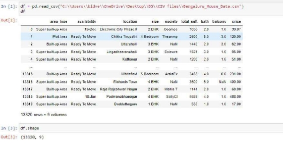

2. **Data Preprocessing and Integration** 

Preprocessing of the data is an essential step in building a good Machine Learning Project 

The data that is provided to the Algorithm needs to be cleaned and in a perfect state for it to give good results. 

Hence first we need to check if there is any missing data is the dataset if there are missing values we replace them we the mean, median of the column  

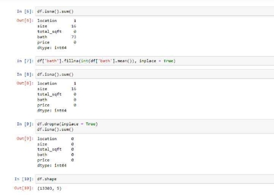

After checking for the missing values we check for uniqueness in the data and change certain columns 

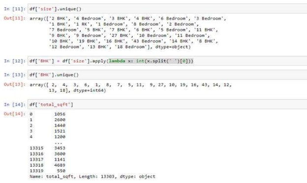

We also drop certain columns whose values are not corelated with the target variable and consider only those columns which are required by the prediction model. 

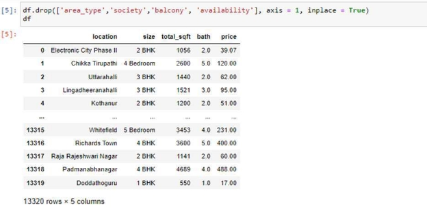

3. **Outlier detection** 

An outlier is an extremely high or extremely low-value value in the data it can be identified if whether the value is greater than interquartile range Q3 + 1.5 or Q1 - 1.5 detecting the interquartile range is arrange the data in an order from the lower value to the higher value, now the mean is taken for the first set of values and second set values now by subtracting both mean we can get the interquartile range the formula is Q3 + (1.5)(quartile range) and for Q1-(1.5)(quartile range) 

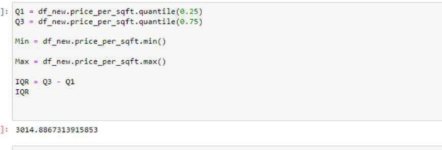

We have used boxplot to check there are outliers present in the data once we identified  the outliers we were successful in removing them by using the removeOutliers function 

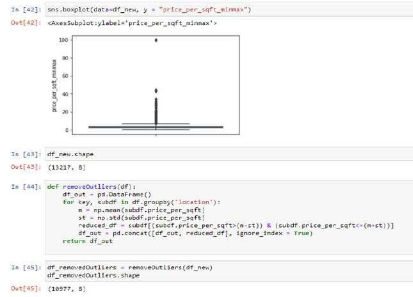

As you can see after removing the outliers our data set was reduced to 10,977 rows hence we can conclude that 2240 rows in the dataset were outliers. 

4. **Data Visualization** 

Data visualization is the graphical representation of information and data. By using visual elements like charts, graphs, and maps, data visualization tools provide an accessible way to see and understand trends, outliers, and patterns in data. Additionally, it provides an excellent way for employees or business owners to present data to non-technical audiences without confusion. 

we see a chart, we quickly see trends and outliers. If we can see something, we internalize it quickly. It’s storytelling with a purpose. If you’ve ever stared at a massive spreadsheet of data and couldn’t see a trend, you know how much more effective a visualization can be. 

**Some other advantages of data visualization include:** Easily sharing information. 

Interactively explore opportunities. 

Visualize patterns and relationships. 

**Disadvantages** 

While there are many advantages, some of the disadvantages may seem less obvious. For example, when viewing a visualization with many different datapoints, it’s easy to make an inaccurate assumption. Or sometimes the visualization is just designed wrong so that it’s biased or confusing. 

Some other disadvantages include: 

Biased or inaccurate information. Correlation doesn’t always mean causation. Core messages can get lost in translation. 

Here we have visualized the data using Box plot. We have plotted the box plot of various locations by considering their total area in square feet and their prices. 

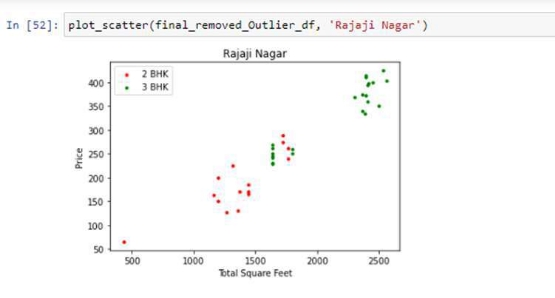

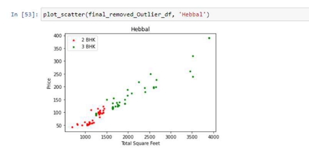

5. **Test Train Split** 

The train-test split procedure is used to estimate the performance of machine learning algorithms when they are used to make predictions on data not used to train the model. 

It  is  a  fast  and  easy  procedure  to  perform,  the  results  of  which  allow  you  to  compare  the performance of machine learning algorithms for your predictive modeling problem. Although simple to use and interpret, there are times when the procedure should not be used, such as when you have a small dataset and situations where additional configuration is required, such as when it is used for classification and the dataset is not balanced. 

The train\_test\_split() method is used to split our data into train and test sets.  

First, we need to divide our data into features (X) and labels (y). The dataframe gets divided into **X\_train,X\_test** , **y\_train and y\_test**. **X\_train** and y\_train sets are used for training and fitting the model. The X\_test and y\_test sets are used for testing the model if it’s predicting the right outputs/labels. We can explicitly test the size of the train and test sets. It is suggested to keep our train sets larger than the test sets. 

**Train set:** The training dataset is a set of data that was utilized to fit the model. The dataset on which the model is trained. This data is seen and learned by the model. 

**Test set:** The test dataset is a subset of the training dataset that is utilized to give an accurate evaluation of a final model fit 

By default, 25% of our data is test set and 75% data goes into training tests. 

We first divided our data set into X and Y and then performed the train-test Split with the random state as 10 

6. **Machine Learning Algorithms** 

Once we have divided the dataset into training  and testing we need to model the data on certain Machine Learning algorithms and then predict the outcome of the data. 

In our project we have used the Linear Regression and Multiple Linear Regression models for prediction. 

1. **Linear Regression**  

Linear  Regression  is  a  supervised  machine  learning  model  that  attempts  to  model  a  linear relationship between dependent variables (Y)  and independent variables (X).  Every evaluated observation with a model, the target (Y)’s actual value is compared to the target (Y)’s predicted value, and the major differences in these values are called residuals. The Linear Regression model aims to minimize the sum of all squared residuals. Here is the mathematical representation of the linear regression: 

Y= a0+a1X+ ε  

In the above equation: 

**Y** = Dependent Variable 

**X** = Independent Variable 

**a0** = Intercept of the line that offers additional DOF or degree of freedom. 

**a1** = Linear regression coefficient, which is a scale factor to every input value. **ε** = Random error 

2. **Multiple Linear Regression**  

` `Multiple regression models can determine which characteristics are the most important to explain the dependent  variable.  Multiple regression analysis also  allows certain  price predictions  by capturing independent and dependent variable data. 

The power of the multiple regression model can be seen when the value of the relationship between dependent  and  independent  variables  is  measured,   multiple  regression  modeling  is  used  to describe improvements to an independent variable with a dependent variable. This model can be achieved using the house price projection as separate and dependent variables like house prices, house size, property sort, number of bedrooms, and many more. Therefore, the house price is set as a target or dependency variable, while other attributes are set as independent variables to determine the main variables by identifying the correlation coefficient of each attribute.  

3. **Random Forest** 

Random forest algorithms can be used to predict both the classification and the regression; it is also called the regression forests. The main process is to develop lots of decision trees based on the random selection of data and the random selection of variables and it provides the class of dependent variables based on many trees. The main advantage of using this algorithm to our dataset is it can handle the missing values and it can maintain the accuracy of the missing data and the chance of overfitting the model is low and we can expect high dimensionality when we apply to the large level dataset. In regression trees, the outcome will be continuous.  

**4. Experiments/Results**  

Once we were done with modeling the data we moved to evaluating the data set and obtaining results. 

We used the Following evaluation metrics for our prediction problem : 

1. **Mean squared Error(MSE)** 

The Mean Squared Error measures how close a[** regression ](https://www.simplilearn.com/tutorials/excel-tutorial/regression-analysis)line is to a set of data points. It is a risk function corresponding to the expected value of the squared error loss.  

Mean square error is calculated by taking the average, specifically the mean, of errors squared from[** data ](https://www.simplilearn.com/what-is-data-article)as it relates to a function.  

A larger MSE indicates that the data points are dispersed widely around its central moment (mean), whereas a smaller MSE suggests the opposite. A smaller MSE is preferred because it indicates that your data points are dispersed closely around its central mome[nt mea](https://www.simplilearn.com/tutorials/data-analytics-tutorial/measures-of-central-tendency)n. It reflects the centralized distribution of your data values, the fact that it is not skewed, and, most importantly, it has fewer errors (errors measured by the dispersion of the data points from its mean). 

MSE = (1/n) \* Σ(actual – forecast)2 

where: 

- Σ – a symbol that means “sum”
- n – sample size
- actual – the actual data value
- forecast – the predicted data value

2. **R squared Error (R^2)** 

-Squared is the ratio of the sum of squares regression (SSR) and the sum of squares total (SST). Sum of Squares Regression (SSR) represents the total variation of all the predicted values found on the regression line or plane from the mean value of all the values of response variables. The sum of squares total (SST) represents the total variation of actual values from the mean value of all the values of response variables. R-squared value is used to measure the goodness of fit or best- fit line. The greater the value of R-Squared, the better is the regression model as most of the variation of actual values from the mean value get explained by the regression model. However, we need to take caution while relying on R-squared to assess the performance of the regression model. This is where the adjusted R-squared concept comes into the picture. This would be discussed in one of the later posts. R-Squared is also termed as the coefficient of determination.  

For the training dataset, the value of R-squared is bounded between 0 and 1, but it can become negative for the test dataset if the SSE is greater than SST. Greater the value of R-squared would also mean a smaller value of MSE. If the value of R-Squared becomes 1 (ideal world scenario), the model fits the data perfectly with a corresponding MSE = 0. As the value of R-squared 

increases  and  becomes  close  to  1,  the  value  of  MSE  becomes  close  to  0.

3. **Root Mean Square Error (RMSE)** 

RMSE is a popular formula to measure the error rate of a regression model, however, it can only be compared between models whose errors are measured in the same units it can be measured using the given formula 

Where n is the number of instances in the data, P is the predicted value for the I instance and O is the actual value the key concept is the predicted value is subtracted by the actual value square that and get the sum of all instances and divided it by number of instances, the RMSE will be achieved. As discussed, the essential variables are used to calculate the error value and help to determine the how well can the algorithm predict the future prices 

**Results**  

After the preprocessing and visualization of our dataset, we realized that for a certain number of attributes we could  use a few models such as Multiple linear regression, Lasso Regression, Decision tree etc. Further evaluating through GridSearchcv, we observed that multiple linear regression was the best suitable model giving the best scores.  

Hence, we were able to evaluate our model successfully by using MSE, R square, RMSE as our evaluation metrics and obtain an accuracy of 85%  and therefore predict the price of various houses in Bangalore by taking in the final parameters as location, area in sq ft, bathroom and BHK. 

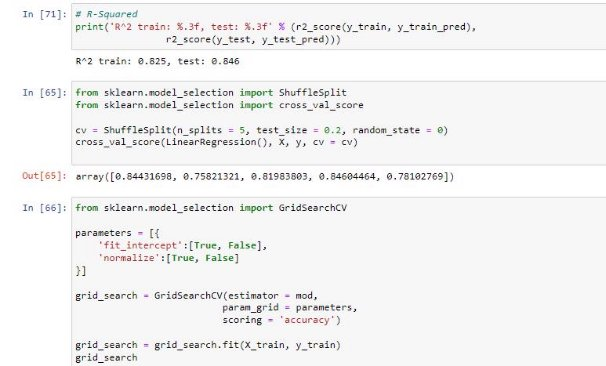

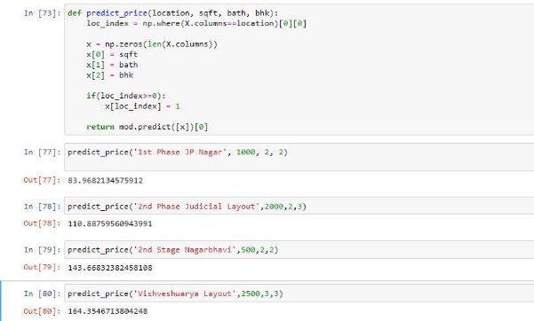

We also compared the three models that we have used and found linear regression to be the best among them and we visualized the result in the form of a bar chart  

We further tried to establish a website which took in all the parameters such as Area(in sq ft), BHK, No. of bathrooms and the locality and in turn give in the price prediction for the house using the multiple regression model we used which gave us the best accuracy among the 3 models we choose. 

A pickle model is exported from the notebook. The model is integrated into a simple and user- friendly website by using the flask server and API requests received from the user are given a suitable HTML server side response from the model imported here. 

The working looks like this -  

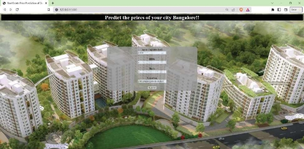

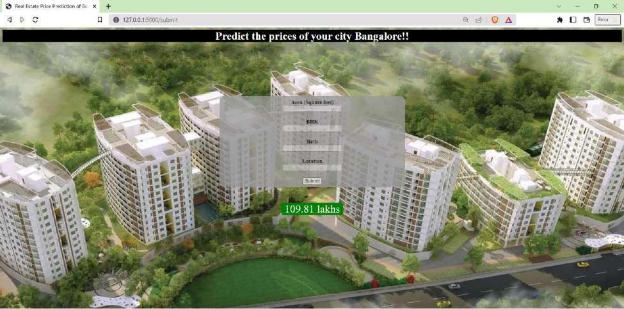

**Conclusion**  

The main goal of this project is to determine the house price prediction  which we have successfully done using different machine learning algorithms like a Linear Regression, Lasso, and Decision Tree.  
It is quite evident from our evaluation that the Linear Regression model has more accuracy in prediction when compared to the others. Moreover, our  project provides a way to find the attributes contribution in prediction. Hence  we could conclude that  this project would  be helpful to a variety of people. The above models of prediction are very efficient from the point of view of linearly dependent data. Thus we use the linear regression techniques. 

